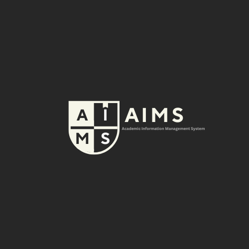

<p align="center">
  
</p>

<h1 align="center">Academic Information Management System</h1>
<h3 align="center">AIMS</h3>
<p align="center"><em>CSAI 151 – Spring 2026 | Team Project</em></p>

---

A role-based Academic Information Management System built entirely in C++17. The system supports three user roles — **Admin**, **Professor**, and **Student** — each with a dedicated dashboard and set of operations.

---

## Team Members

| Name | ID | Email |
|---|---|---|
| Zeyad Yasser Gamal | 202508164 | s-zeyad.saad@zewailcity.edu.eg |
| Mahmoud Mohamed Ibrahim | 202510225 | s-mahmoud.radwan11@zewailcity.edu.eg |
| Abdelrahman Mohamed Hamed | 202508139 | s-abdulrahman.shreif@zewailcity.edu.eg |

---

## Features

### Admin
- Add / Delete students
- Create and edit courses
- Assign instructors to courses
- View and search all courses
- Archive course data
- Generate reports

### Professor
- View assigned courses
- Submit and update grades
- View enrolled students per course
- Generate course reports
- Update office hours

### Student
- Register for / drop courses
- View schedule and transcript
- Check GPA and balance
- Verify scholarship eligibility
- Access payment portal

---

## Project Structure

```
AIMS/
├── main.cpp                    # Entry point & role-based session management
│
├── Core/
│   ├── Course.h / Course.cpp               # Course entity
│   └── CourseManager.h / CourseManager.cpp # Course collection management
│
├── Users/
│   ├── Student.h / Student.cpp             # Student user class
│   ├── Professor.h / Professor.cpp         # Professor user class
│   └── Admin.h / Admin.cpp                 # Admin user class
│
├── Auth/
│   └── AuthenticationManager.h / .cpp      # Login & registration logic
│
├── UI/
│   └── UI.h / UI.cpp                       # All menus and display functions
│
└── Operations/              # 16 stateless functionality classes
    ├── addStudent
    ├── deleteStudent
    ├── createCourse
    ├── editCourseInfo
    ├── setGrades
    ├── assignInstructor
    ├── generateReport
    ├── verifyScholarship
    ├── archiveData
    ├── login
    ├── registerCourse
    ├── dropCourse
    ├── viewTranscript
    ├── viewSchedule
    ├── paymentPortal
    └── searchCourse
```

---

## Architecture

The project follows a **stateless operation-class pattern**: each of the 16 functionality classes is stateless and receives the shared data stores (students, courses, etc.) by reference. This keeps operations modular and the core data classes clean.

All data is stored **in-memory** using STL vectors — no external database or file persistence is required for the current phase.

---

## Build & Run

### Requirements
- g++ with C++17 support
- `make`

### Compile

```bash
make
```

Or manually:

```bash
g++ -std=c++17 -o AIMS main.cpp Course.cpp CourseManager.cpp Student.cpp Professor.cpp Admin.cpp UI.cpp AuthenticationManager.cpp
```

### Run

```bash
./AIMS
```

---

## Demo Credentials

The system seeds demo accounts at startup for testing:

| Role | ID / Username | Password |
|---|---|---|
| Admin | `admin_user` | `admin123` |
| Student | `S001` | `pass123` |
| Student | `S002` | `pass456` |
| Professor | `P001` | `prof123` |
| Professor | `P002` | `prof456` |

---

## Development Notes

- **Language:** C++17
- **Build system:** `make` (Makefile) / CMake (`CMakeLists.txt`)
- **IDE:** CLion (`.idea/` config included)
- **Password scheme:** Placeholder prefix-hash (to be replaced in a later phase)
- **Persistence:** In-memory only for current phase — file I/O or database integration planned for Phase 3

---

## Project Phases

| Phase | Status | Description |
|---|---|---|
| Phase 1 | ✅ Complete | Project proposal & system design documentation |
| Phase 2 | ✅ Complete | Core class implementation, UI, and all 16 operation classes |
| Phase 3 | 🔄 In Progress | TBD — likely file persistence, expanded features, or GUI |
